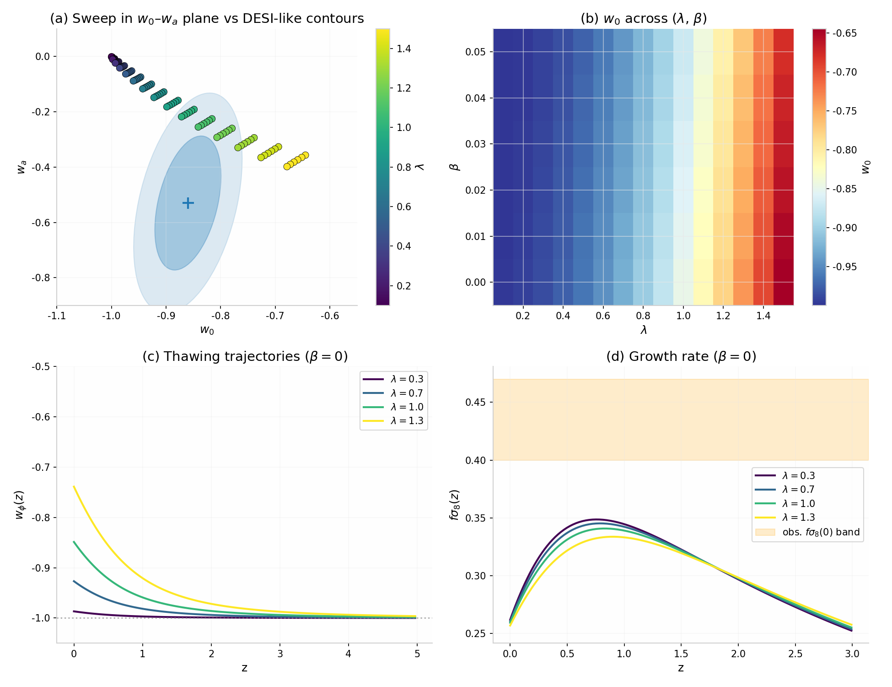
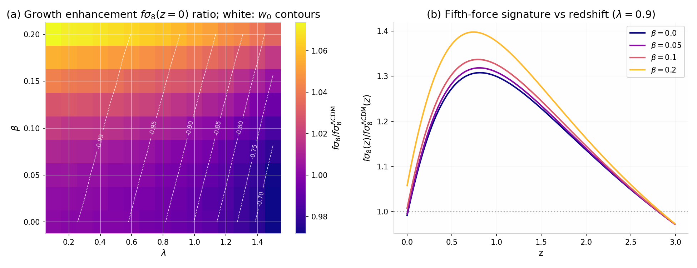
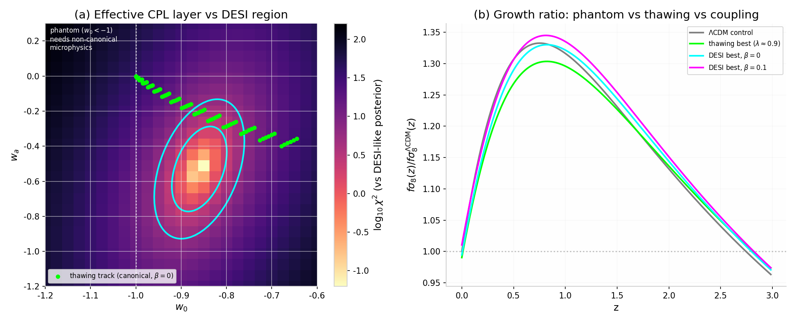
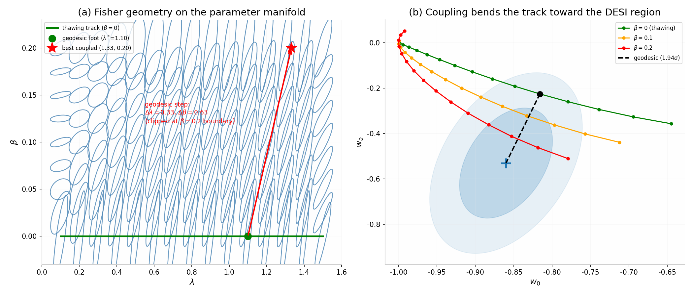
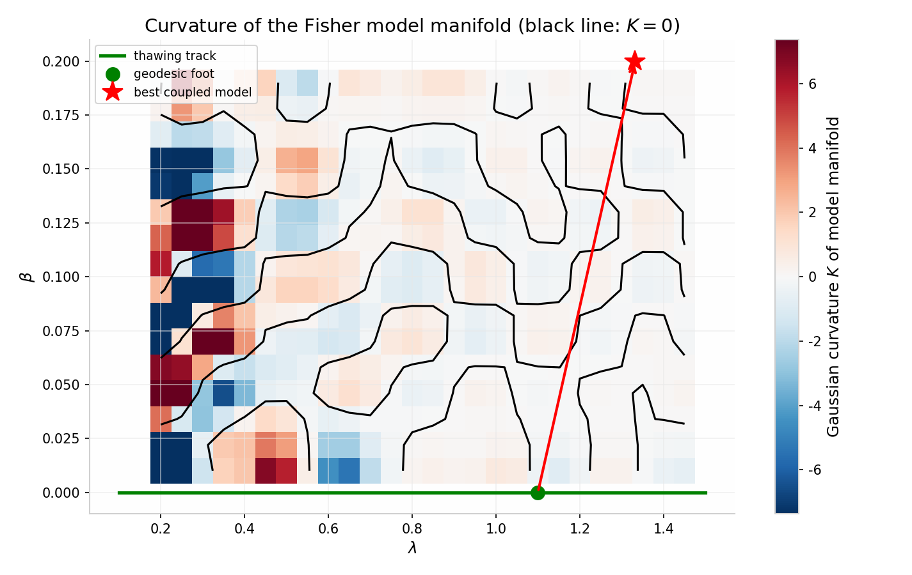
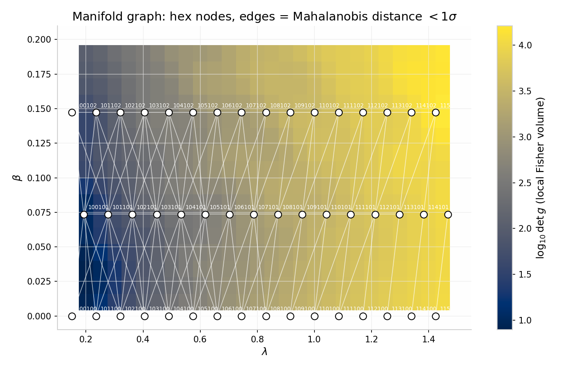

# The Geometry of Coupled Quintessence

**Parameter Sweeps, Fisher Geometry, and Packing Analysis of a
Dark-Energy–Dark-Matter Interaction Model**

*A Consolidated Simulation and Information-Geometry Report*

Computational cosmology working report — August 2026

---

## Contents

1. [Introduction and Motivation](#1-introduction-and-motivation)
2. [The Model: Coupled Quintessence as a Dynamical System](#2-the-model-coupled-quintessence-as-a-dynamical-system)
3. [Simulation Engine Design](#3-simulation-engine-design)
4. [Background Parameter Sweeps](#4-background-parameter-sweeps)
5. [Growth Sweeps: The Fifth-Force Observable](#5-growth-sweeps-the-fifth-force-observable)
6. [The Effective (Phantom) Layer](#6-the-effective-phantom-layer)
7. [Fisher Geometry of the Model Manifold](#7-fisher-geometry-of-the-model-manifold)
8. [Packing Geometry: Distinguishability and Optimal Covering](#8-packing-geometry-distinguishability-and-optimal-covering)
9. [Conclusions and Caveats](#9-conclusions-and-caveats)

Appendix A. [Machine-Readable Manifold Graph](#appendix-a-machine-readable-manifold-graph)

[References](#references)

---

## 1. Introduction and Motivation

Recent baryon acoustic oscillation measurements from the Dark Energy
Spectroscopic Instrument (DESI), combined with CMB and supernova data,
hint that the dark energy equation of state may deviate from the
cosmological constant value $w = -1$, with a combined preference in
the Chevallier–Polarski–Linder (CPL) plane for $w_0 \approx -0.9$ and
a negative time evolution $w_a < 0$ [1][2]. This report consolidates
a numerical investigation of one candidate physics class — coupled
quintessence, in which a scalar field $\phi$ rolls in an exponential
potential while exchanging energy with pressureless dark matter [3] —
and reframes the parameter constraints as problems in information
geometry.

The investigation proceeded in six stages, each documented below:

1. construction of a background expansion and linear-growth
   integration engine;
2. parameter sweeps over the potential slope $\lambda$ and coupling
   $\beta$;
3. an effective CPL layer reaching the phantom regime $w_0 < -1$ that
   canonical fields cannot access;
4. the Fisher (Mahalanobis) geometry of the model manifold, including
   the geodesic distance from the canonical model family to the
   DESI-preferred region;
5. the intrinsic curvature of that manifold; and
6. a packing-geometry analysis quantifying how many statistically
   distinguishable cosmologies the model family contains.

---

## 2. The Model: Coupled Quintessence as a Dynamical System

### 2.1 Background equations

We adopt the standard dimensionless autonomous formulation for a
scalar field with exponential potential $V(\phi) = V_0
e^{-\lambda\phi/M_{Pl}}$ conformally coupled to dark matter with
strength $\beta$ [4]. With $x \equiv \dot\phi/(\sqrt{6}\, H\, M_{Pl})$,
$y \equiv \sqrt{V/(3H^2 M_{Pl}^2)}$, and $z \equiv \Omega_r$ the
radiation fraction, evolution in e-folds $N = \ln a$ obeys

$$
\begin{aligned}
x' &= -3x + \sqrt{\tfrac{3}{2}}\,\lambda\, y^2
       + \tfrac{3}{2} x\!\left(1 + x^2 - y^2 + \tfrac{z}{3}\right)
       - \sqrt{\tfrac{3}{2}}\,\beta\, \Omega_m,\\
y' &= -\sqrt{\tfrac{3}{2}}\,\lambda\, x\, y
       + \tfrac{3}{2} y\!\left(1 + x^2 - y^2 + \tfrac{z}{3}\right),\\
z' &= z\!\left(-1 + 3 x^2 - 3 y^2 + z\right),
\end{aligned}
\qquad (1)
$$

with $\Omega_m = 1 - x^2 - y^2 - z$, dark-energy fraction
$\Omega_\phi = x^2 + y^2$, and field equation of state

$$
w_\phi = \frac{x^2 - y^2}{x^2 + y^2} \;\ge\; -1,
\qquad (2)
$$

where the inequality is saturated only for a vanishing kinetic
term — canonical fields cannot cross $w = -1$.

### 2.2 Linear growth with a fifth force

Sub-horizon dark-matter perturbations $\delta_m$ obey

$$
\delta_m'' + \left[1 + \tfrac{1}{2}(1 - 3 w_\mathrm{eff})\right]\delta_m'
- \tfrac{3}{2}\,\Omega_m\, \frac{G_\mathrm{eff}}{G}\, \delta_m = 0,
\qquad
\frac{G_\mathrm{eff}}{G} = 1 + 2\beta^2,
\qquad (3)
$$

where the enhancement $1 + 2\beta^2$ is the scalar-mediated fifth
force between dark-matter particles. We track
$f = d \ln \delta_m / d \ln a$ and $f\sigma_8(z)$.

---

## 3. Simulation Engine Design

### 3.1 Failure of backward integration

An initial implementation integrated the system backward from
present-day boundary conditions $(w_0, \Omega_{\phi,0})$. A 384-run
diagnostic sweep showed that every such model violates early-universe
bounds catastrophically, with $\Omega_\phi(z \approx 1100) \approx
0.94$ regardless of parameters. This is the well-known attractor
problem: generic late-time conditions do not lie on the early-time
scaling trajectory, and thawing quintessence is unstable under time
reversal. Geometrically, the viable models form an exponentially thin
separatrix of the flow.

**Design principle.** Thawing quintessence must be integrated
*forward* from early-universe initial conditions, with the
present-day density targeted by a shooting method.

### 3.2 Forward engine and shooting

The production engine starts at $N_i = -14$ ($z \sim 10^6$) in
radiation domination with correct matter–radiation balance, $x_i = 0$,
$y_i = \sqrt{\Omega_{\phi,i}}$, and matter-era perturbation initial
conditions. For each $(\lambda, \beta)$, a bisection on
$\Omega_{\phi,i}$ pins $\Omega_\phi(0) = 0.685 \pm 5 \times 10^{-4}$.
The required initial densities are $\Omega_{\phi,i} \sim 10^{-21}$,
making the fine-tuning of thawing models explicit and quantified
rather than assumed. A ΛCDM control run ($\lambda \to 0$, $\beta = 0$)
calibrates all growth observables; because the sub-horizon growth
equation systematically underestimates $f$ in the radiation era, all
$f\sigma_8$ results are reported as ratios to the control.

---

## 4. Background Parameter Sweeps

With $\Omega_{\phi,0}$ pinned, 90 models over $\lambda \in [0.1, 1.5]$
and $\beta \in [0, 0.05]$ were integrated. All satisfy the null
energy condition and the early-dark-energy bound
$\Omega_\phi(z \approx 1100) < 0.02$ by construction. The results
show a clean degeneracy structure.

**Table 1** — Background sweep means over $\beta$ (coupling negligible
at background level).

| λ   | w₀     | wₐ     |     | λ   | w₀     | wₐ     |
|-----|--------|--------|-----|-----|--------|--------|
| 0.1 | −0.999 | −0.002 |     | 0.9 | −0.888 | −0.171 |
| 0.3 | −0.990 | −0.022 |     | 1.1 | −0.828 | −0.241 |
| 0.5 | −0.969 | −0.058 |     | 1.3 | −0.754 | −0.312 |
| 0.7 | −0.935 | −0.109 |     | 1.5 | −0.662 | −0.378 |

The potential slope $\lambda$ alone selects the position on the
thawing track in the $(w_0, w_a)$ plane; $\beta \le 0.05$ is invisible
at background level. The track passes above the DESI-preferred
region, with best overlap at $\lambda \approx 0.8$–$1.0$ near the 2σ
boundary (Figure 1).

*Figure 1. Background sweep: (a) thawing track vs DESI-like contours
in the $w_0$–$w_a$ plane; (b) $w_0$ across the $(\lambda, \beta)$
plane; (c) thawing trajectories $w_\phi(z)$; (d) growth rate
$f\sigma_8(z)$ with the observational band.*

---

## 5. Growth Sweeps: The Fifth-Force Observable

Extending the coupling range to $\beta \in [0, 0.2]$ (135 models)
exposes where the coupling lives: **the growth sector**. Relative to
the ΛCDM control, $f\sigma_8(z=0)$ rises by +1% at $\beta = 0.05$ and
+7% at $\beta = 0.2$, scaling as $G_\mathrm{eff}/G = 1 + 2\beta^2$,
while varying $\lambda$ changes it by only $-2\%$. The two parameters
are therefore observationally **orthogonal**: $\lambda$ sets the
expansion history, $\beta$ sets structure growth — the
degeneracy-breaking that joint BAO+RSD analyses exploit.

The fifth-force signature is redshift-dependent: the ratio
$f\sigma_8(z)/f\sigma_8^{\Lambda\mathrm{CDM}}(z)$ peaks near
$z \approx 0.7$–$0.9$ (reaching $\sim 1.4$ at $\beta = 0.2$ in the
sub-horizon approximation), because enhancement accumulates over the
matter era while late-time dark-energy friction partially cancels it
at $z = 0$ (Figure 2). This shape is a genuine discriminator against
a simple $\sigma_8$ rescaling.

*Figure 2. (a) Growth enhancement
$f\sigma_8(0)/f\sigma_8^{\Lambda\mathrm{CDM}}(0)$ across
$(\lambda, \beta)$ with $w_0$ contours; (b) redshift dependence of the
fifth-force signature at $\lambda = 0.9$.*

---

## 6. The Effective (Phantom) Layer

Because $w_\phi \ge -1$ for canonical fields (Eq. 2), the region
$w_0 < -1$ was probed with an **effective CPL background**
$w(a) = w_0 + w_a(1 - a)$, retaining the $\beta$-dependent growth
equation. A sweep of 1,250 models over $w_0 \in [-1.2, -0.6]$,
$w_a \in [-1.2, 0.3]$ scored against a DESI-like posterior
($\chi^2$ Mahalanobis distance) finds:

- The posterior minimum ($w_0 \approx -0.85$, $w_a \approx -0.51$,
  $\chi^2 \approx 0.06$) sits at $w_0 > -1$ but with strongly
  negative $w_a$ — a trajectory that crossed $w = -1$ from below at
  higher redshift (quintom-like behavior).
- The canonical thawing track only clips the upper 2σ edge; its
  closest point carries $\chi^2 \approx 4.8$.
- The phantom-side $\chi^2$ landscape is flat: the data preference
  concerns the **crossing dynamics**, not sitting below $-1$ today.
- The best effective models have ΛCDM-like $f\sigma_8(0)$ but
  distinguishable $f\sigma_8(z)$ shapes above $z \approx 0.5$
  (Figure 3).

*Figure 3. (a) $\log_{10}\chi^2$ of the effective CPL layer vs the
DESI-like posterior, with the canonical thawing track overlaid;
(b) growth ratios for the thawing best, DESI best, and DESI best with
coupling.*

---

## 7. Fisher Geometry of the Model Manifold

### 7.1 Setup

Treat the observable vector $\Theta = (w_0, w_a, f\sigma_8)$ as a
point in a space endowed with the Fisher metric from the data
covariance $C$ (DESI-like $w_0$–$w_a$ covariance plus a 2% RSD
growth error). The parameter manifold $(\lambda, \beta)$ inherits the
pullback metric

$$
g_{ij} = (J^{\mathsf{T}} C^{-1} J)_{ij}, \qquad
J = \frac{\partial \Theta}{\partial(\lambda, \beta)}.
\qquad (4)
$$

The ellipse field of $g$ (Figure 4a) is anisotropic (median
weak/strong eigenvalue ratio $\approx 0.08$) but nowhere flat once
growth data is included.

### 7.2 The geodesic problem and its solution

**Result (geodesic distance).** The closest canonical thawing model
to the DESI mean is $\lambda_* = 1.10$, i.e.
$(w_0, w_a) = (-0.816, -0.226)$, at a Mahalanobis distance of
**1.94σ**. The geodesic direction (whitened) is
$(-0.56, -0.83, 0.07)$ in $(w_0, w_a, f\sigma_8)$: the data requests
primarily steeper time evolution, not a growth modification.

**Result (parameter-space lift).** Lifting the geodesic to the
parameter manifold gives the step
$(\Delta\lambda, \Delta\beta) = (0.33, 0.63)$ — dominated by coupling.
Minimizing over the full $(\lambda, \beta)$ grid yields
$(1.33, 0.20)$ at **0.87σ**, inside the 1σ ellipse.

The mechanism: matter-to-dark-energy transfer makes the dark-energy
density dilute more slowly than any self-conserved $w \ge -1$ fluid,
so the expansion history of a coupled canonical model mimics phantom
behavior without ghost microphysics [5]. At fixed $\lambda$,
increasing $\beta$ bends the $(w_0, w_a)$ track toward the DESI
region (Figure 4b). The geodesic is clipped at the grid boundary
$\beta = 0.2$, indicating even stronger coupling would fit better —
though independent CMB and local-gravity bounds restrict
$\beta \lesssim 0.1$ in practice.

*Figure 4. (a) Fisher-metric ellipse field on the parameter manifold
with the thawing track, geodesic foot, and best coupled model;
(b) coupling bends the model track toward the DESI-preferred region.*

### 7.3 Intrinsic curvature

Computing Christoffel symbols from second derivatives of the
observable map and the Gaussian curvature $K = R_{1212}/\det g$
(Figure 5):

- Along the geodesic path ($\lambda \gtrsim 0.8$), $K \approx 0$. The
  parameterization is **metrically honest** where the model
  selection happens; linear error propagation is reliable there.
- At $\lambda \lesssim 0.5$ the curvature estimates spike and
  oscillate. There the observable map becomes nearly
  $\beta$-independent ($w_0 \to -1$ regardless), $\det g \to 0$, and
  curvature — dividing by $\det g$ — amplifies noise. This is the
  signature of a **caustic**: the 2D model manifold collapses toward a
  1D curve at the $\Lambda$ limit. Specific values in this region are
  unreliable, but the degeneracy itself is real.
- Mild saddle structure ($K$ alternating sign) at intermediate
  $\lambda$ reflects the nonlinear mapping from thawing rate to
  $(w_0, w_a)$.

*Figure 5. Gaussian curvature of the Fisher model manifold. Black
contours mark $K = 0$; the geodesic path lies in a near-flat region,
while the $\Lambda$ limit (low $\lambda$) is a degenerate caustic.*

---

## 8. Packing Geometry: Distinguishability and Optimal Covering

### 8.1 Model packing: four distinguishable cosmologies

Two parameter points within 1σ Mahalanobis distance are
indistinguishable to the data, so counting statistically distinct
cosmologies is a sphere-packing problem on the model manifold:
$N = V / V_\mathrm{cell}$, with volume element $\sqrt{\det g}$ and
$V_\mathrm{cell} = \pi$ for a 1σ disk in two dimensions. Integrating
over the $(\lambda, \beta)$ region:

**Result (packing number).** The Fisher volume of the model region is
$V \approx 11.9\,\sigma^2$, giving $N \approx 4$ distinguishable 1σ
cosmologies. 90% of the volume lies at $\lambda \gtrsim 0.6$; the
entire low-$\lambda$ family compresses into ~10%. The $\beta$
direction contributes roughly uniformly (30 / 32 / 38% by band).

This is the quantitative statement of the degeneracy: theory space is
large, distinguishability space tiny — and it is the same geometric
event as the curvature caustic of §7.3, seen from the volume side.

**Table 2** — Covering costs for full 1σ resolution of the model
manifold.

| Grid                    | Covering density                | Templates needed | Note                    |
|-------------------------|---------------------------------|------------------|-------------------------|
| Hexagonal (optimal)     | $2\pi / (3\sqrt{3}) \approx 1.209$ | ≈ 5              | Kershner-optimal        |
| Square                  | $\pi/2 \approx 1.571$           | ≈ 6              | +23% vs optimal         |
| This work (rectangular) | —                               | 135              | ∼25× oversampled        |

While oversampling is harmless for cheap ODE runs, it becomes the
binding constraint when each evaluation is a Boltzmann-code call. The
optimal lattice is hexagonal in the Fisher metric — the ellipse field
of Figure 4a specifies exactly how to deform the placement.

---

## Appendix A. Machine-Readable Manifold Graph

To make the geometry accessible to downstream AI agents (and to
humans who prefer graph structure over tensor calculus), the model
manifold is exported as a discrete hexagonal (A2 lattice) graph.
Nodes are placed on a hexagonal lattice in $(\lambda, \beta)$
coordinate space; edges connect node pairs whose Mahalanobis
separation under the local Fisher metric is below 1σ — so graph
adjacency literally encodes statistical distinguishability. Each
node carries its full local state as a JSON payload (Figure 6):
axial coordinates $(q, r)$, the list of topological neighbors
(enabling geodesic traversal as pure graph search, with no online
matrix operations), the observable vector
$(w_0, w_a, f\sigma_8/f\sigma_8^{\Lambda\mathrm{CDM}})$, the metric
tensor $g_{ij}$ and its determinant, the local Gaussian curvature
$K$, and a singularity flag raised where $\det g$ collapses (the
$\Lambda$-limit caustic of §7.3).

*Figure 6. The 48-node hexagonal manifold graph over the
Fisher-volume landscape. Edges connect nodes within 1σ Mahalanobis
distance: note the dense vertical connectivity at low $\lambda$,
where the metric degenerates and entire columns of parameter space
become mutually indistinguishable.*

The edge structure visualizes the packing result of §8 directly: at
high $\lambda$ the graph is a sparse near-chain (each node its own
distinguishability cell), while at low $\lambda$ columns merge into
fully connected cliques — one cell swallowing many parameter points.
The graph is distributed as
[`figures/manifold_graph_payload.jsonl`](figures/manifold_graph_payload.jsonl)
(one JSON object per node), sized for prompt injection, multi-agent
communication, or vector-store indexing. Two corrections were applied
to the original encoder design: the whitening transform now uses the
correct ordering $\Lambda\, E^{\mathsf{T}}$ for a symmetric metric,
and the axial cell identifier is offset to avoid collisions for
negative lattice coordinates.

---

## 9. Conclusions and Caveats

**Conclusions.**

1. Viable thawing quintessence requires forward integration with shot
   initial conditions; backward integration is structurally
   unphysical.
2. In the $(\lambda, \beta)$ family, $\lambda$ controls the expansion
   history and $\beta$ controls growth — orthogonal observational
   axes.
3. The canonical thawing track misses the DESI-preferred region by
   1.94σ; the shortfall is dominantly a $w_a$-deficit.
4. The conformal coupling $\beta$ bends the model track toward the
   data — a canonical route to phantom-mimicry — with a best fit at
   $(\lambda, \beta) \approx (1.33, 0.20)$ inside 1σ, though
   $\beta \gtrsim 0.1$ conflicts with independent bounds.
5. The model manifold is flat along the geodesic that matters and
   degenerate where the answer is $\Lambda$; the region resolves at
   most $\approx 4$ distinguishable 1σ cosmologies.

**Caveats.**

1. Absolute $f\sigma_8$ values are systematically low (the ΛCDM
   control reads 0.26); all growth conclusions rely on ratios and
   shapes, and calibration requires a Boltzmann code.
2. The DESI posterior used is a mock approximation of published
   contours; numbers should be refreshed with the released
   covariance.
3. Coupling constraints from the CMB and local gravity were not
   folded into the allowed ellipse in the $\beta$ direction.
4. Curvature values near the $\Lambda$ caustic are noise-amplified
   and indicative only.
5. The growth equation uses the sub-horizon approximation and
   neglects scale-dependent screening, which becomes relevant for
   $\beta \gtrsim 0.1$.
6. The hexagonal-graph encoding of Appendix A assumes the Fisher
   metric is locally constant over each cell; validation against
   exact geodesic distances is recommended.
7. CMB constraints on $\Omega_{\phi,\mathrm{early}}$ were enforced
   but not fully marginalized over nuisance parameters.

**Suggested next steps.** Swap in the DESI DR2 covariance; port the
background to CLASS/CAMB with a coupled-dark-energy module for
calibrated $f\sigma_8$ and CMB lensing; extend the manifold with a
quintom (two-field) direction and recompute the packing number.

---

## References

1. DESI Collaboration (2024). *DESI 2024 VI: Cosmological constraints
   from the measurements of baryon acoustic oscillations.*
   arXiv:2404.03002.
2. Chevallier, M., & Polarski, D. (2001). *Accelerating universes
   with scaling dark matter.* International Journal of Modern Physics
   D, **10**, 213; Linder, E. V. (2003). *Exploring the expansion
   history of the universe.* Physical Review Letters, **90**, 091301.
3. Amendola, L. (2000). *Coupled quintessence.* Physical Review D,
   **62**, 043511.
4. Copeland, E. J., Liddle, A. R., & Wands, D. (1998). *Exponential
   potentials and cosmological scaling solutions.* Physical Review D,
   **57**, 4686.
5. Das, S., Corasaniti, P. S., & Khoury, J. (2006). *Superacceleration
   as the signature of a dark sector interaction.* Physical Review D,
   **73**, 083509.
6. Kershner, R. (1939). *The number of circles covering a set.*
   American Journal of Mathematics, **61**(3), 665–671.
7. Planck Collaboration (2020). *Planck 2018 results. VI. Cosmological
   parameters.* Astronomy & Astrophysics, **641**, A6.
