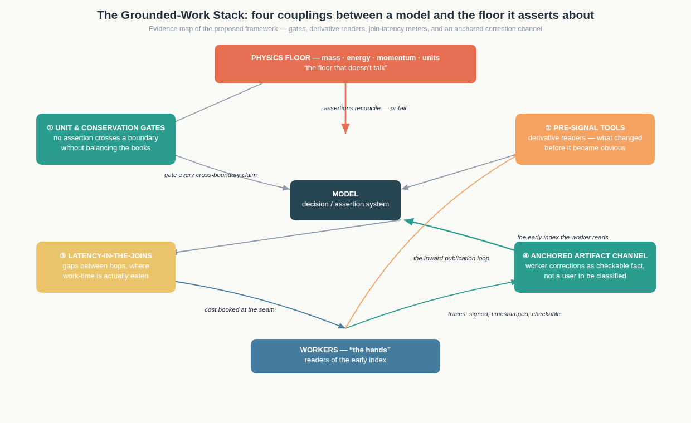
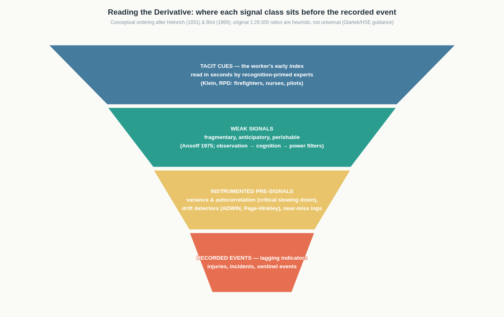
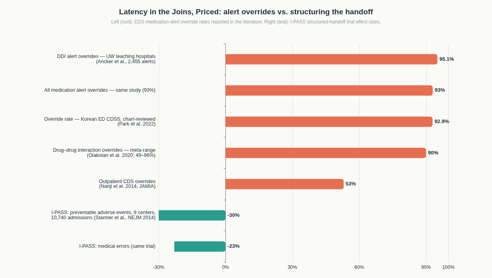
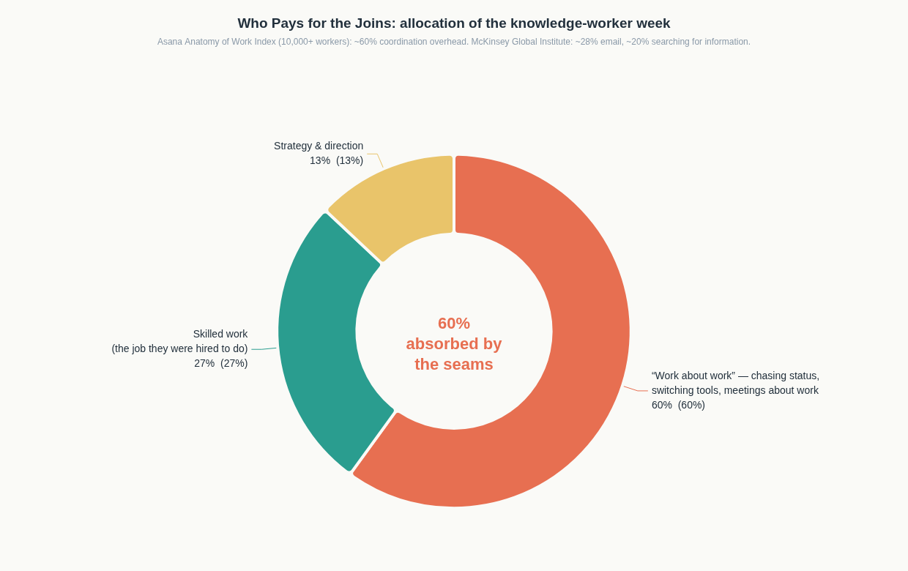

# Balancing the Books at the Boundary: An Evidence-Based Deep Research Report on Physical-Consistency Gates, Pre-Signal Readers, Join-Latency Measurement, and Inward Worker-Correction Channels for Machine Learning Systems

## Executive Summary

The framework under examination proposes four mechanisms for coupling a model to the reality it asserts about: **unit-and-conservation gates** that forbid cross-boundary assertions unless the books balance; **pre-signal tools** that read the derivative of a situation rather than the recorded event; **latency-in-the-joins measurement** that prices the gaps between hops where worker time is actually consumed; and, deepest of all, an **anchored data channel** through which workers' corrections persist as checkable artifacts rather than as testimony that must be believed in the moment. This report maps each element onto the available research literature, institutional practice, and quantitative evidence, and then stress-tests the framework as a whole.

The core finding is that **none of the four elements is speculative**: each has a mature or maturing evidentiary base somewhere in the research landscape, but the bases are scattered across disciplines that rarely cite one another. Hard-constraint architectures in scientific machine learning enforce conservation laws to machine precision and simultaneously improve out-of-distribution generalization ([Royal Society](https://royalsocietypublishing.org/rsta/article/379/2194/20200093/41210/Physics-informed-machine-learning-case-studies-for), [PMLR](https://proceedings.mlr.press/v202/hansen23b/hansen23b.pdf)). Leading-indicator regimes are codified in occupational-safety standards, and statistical early-warning methods can detect loss of resilience before regime shifts, though with documented blind spots ([Journal of Safety Research](https://www.sciencedirect.com/science/article/pii/S0022437523000531), [PMC](https://pmc.ncbi.nlm.nih.gov/articles/PMC4247400/)). The cost of the joins is quantified: a single teaching hospital passes through roughly **4,000 handoffs per day**, communication failures contribute to at least **30% of malpractice claims** with **1,744 deaths and $1.7 billion** in costs over five years, and structuring the handoff with the I-PASS protocol cut preventable adverse events by **30%** in a nine-center trial ([Joint Commission](https://digitalassets.jointcommission.org/api/public/content/a05e74ef89484e2084b6511189b73a99?v=279f39cc)). And the inward publication loop has a fifty-year institutional existence proof in NASA's Aviation Safety Reporting System, which has converted more than **2.3 million** voluntary, non-punitive, de-identified frontline reports into system-level hazard knowledge ([NASA](https://www.nasa.gov/human-systems-integration-division/aviation-safety-reporting-system-overview/)).

The critical evaluation finds three structural risks the framework must answer. The **irony of automation**: the worker skills that the correction channel depends on are precisely the skills that successful automation erodes, so the channel must be designed to keep expertise exercised, not merely harvested. The **Goodhart failure mode of leading indicators**: metrics intended to read the derivative are gameable and can decouple from actual risk. And the **political asymmetry** between the elements: gates, readers, and latency meters are instrumentable, while the correction channel is a governance institution whose failure mode is testimonial injustice — the systematic discounting of a knower's word — which no amount of cryptographic anchoring fixes by itself ([IEP](https://iep.utm.edu/epistemic-injustice/), [Medium/Craig Trim](https://medium.com/@craigtrim/the-ironies-of-automation-0f302343bf7d)).

---

## 1. Restating the Framework in Operational Terms

The source text is compressed, so this report begins by fixing an interpretation that the evidence can engage with. A **model** here means any system that emits assertions or decisions about a physical or organizational process: a neural network emulator of a climate variable, a clinical decision support system, a scheduling algorithm, an LLM writing into an engineering pipeline. A **boundary** is any interface across which quantities flow — between cells of a simulation, between software components exchanging a file, between a model's output and the world it describes. The **worker** or "the hands" is the person in contact with the physical or operational process, whose perception runs ahead of the instrumentation and whose corrections currently evaporate without leaving a training signal. The framework's four elements are then: gating assertions on dimensional and conservation consistency; instrumenting the *pre-obvious* change rather than the post-fact event; measuring the inter-hop gaps where coordination cost actually falls; and building a provenance-anchored channel that turns worker corrections into durable, checkable artifacts a model can consume without a credibility contest.

Two features of the framework distinguish it from generic "AI safety" or "MLOps best practice" discourse. The first is its **bookkeeping metaphor taken literally**: conservation laws and unit consistency are double-entry accounting applied to physics, and the claim is that a model should be unable — architecturally, not aspirationally — to emit an assertion that does not balance. The second is its **epistemology of the correction**: the deepest problem is not that workers lack knowledge but that their knowledge arrives as testimony, which hearers are free to discount; the proposed solution is to change the *format* of the knowledge from testimony to artifact, so that belief in the moment is no longer the bottleneck. Figure 1 lays out the four couplings and the flows between them.

The sections that follow take each element in turn, first presenting the strongest evidence that the mechanism works and is needed, then the documented limits. A synthesis section examines how the four interlock, and a critical evaluation identifies where the framework strains against forty years of human-factors and organizational research. The report closes with a design-implication matrix that translates each element into implementable practice.

---

## 2. Element One: Unit-and-Conservation Gates

### 2.1 The catastrophic baseline: what an ungated boundary costs

The canonical demonstration that "the model can't assert across a boundary without balancing the books" is not a machine learning case at all — it is the loss of NASA's **Mars Climate Orbiter** in September 1999. The Mishap Investigation Board determined the root cause to be a failure of unit consistency at a software interface: a ground software file called SM_FORCES reported thruster impulse data in pound-force seconds while the Software Interface Specification required newton-seconds, so downstream navigation processing underestimated the effect of thruster firings by a factor of **4.45**, the conversion factor between pound-force and newtons ([NASA MIB](https://llis.nasa.gov/llis_lib/pdf/1009464main1_0641-mr.pdf)). The error was not dramatic in any single step; it accumulated quietly through repeated small trajectory-modeling errors until the spacecraft's computed path diverged fatally from its actual one, with post-loss reconstruction showing a periapsis of roughly 57 km rather than the intended 140–150 km ([Medium/Ferro](https://medium.com/@omarvferro/how-one-unit-cost-nasa-125m-the-metric-vs-imperial-mistake-that-sank-a-mars-orbiter-d8eb009ecce7), [PE Impact](https://peimpact.com/mars-climate-orbiter-failure-may-2026/)). The mission, valued at approximately $125 million, was lost over what the investigation framed as an interface-control and verification failure — a valid-looking number carrying the wrong unit across a boundary.

Two details of the case matter enormously for the wider framework, because they prefigure elements two and four. First, the discrepancy between calculated and measured position was noticed earlier by at least two navigators, whose concerns were dismissed because they "did not follow the rules about filling out the form to document their concerns" — the pre-signal existed, was read by the workers closest to the instrument, and died in a credibility filter ([Wikipedia](https://en.wikipedia.org/wiki/Mars_Climate_Orbiter)). Second, NASA's own officials explicitly declined to blame the contractor and instead cited NASA's failure to make "the appropriate checks and tests that would have caught the discrepancy" — an admission that the missing artifact was a *gate*, an automated reconciliation that does not depend on anyone being believed. The Board's forward recommendation for the sibling Mars Polar Lander project reads like a specification for element one: verify consistent use of units throughout design and operations, and audit software for specification compliance on all data transferred between teams ([NASA MIB](https://llis.nasa.gov/llis_lib/pdf/1009464main1_0641-mr.pdf)).

### 2.2 The constructive evidence: hard constraints in scientific machine learning

On the machine learning side, the research question of the last several years has been exactly whether a model can be made incapable of unbalanced assertions. The answer from the physics-informed learning literature is nuanced but strongly supportive of the framework's intuition. Unconstrained deep learning models trained on physical data routinely violate fundamental principles — negative mass, energy creation in heat-transfer problems, minimum temperatures predicted above maximum temperatures — even when the training data contains no such violations, because at inference time the model extrapolates patterns in illicit ways ([Amazon Science](https://www.amazon.science/blog/physics-constrained-machine-learning-for-scientific-computing), [RPTU thesis](https://kluedo.ub.rptu.de/files/8675/physics_constrained_deep_learning_for_climate_modeling.pdf)). The critical empirical finding is about *how* the gate must be built. Adding the conservation law as a soft penalty in the loss function — the Lagrange-dual approach used by vanilla physics-informed neural networks — gives "very weak control" over the physical property: Hansen et al. found that a soft-constrained model violated conservation **more** than the fully unconstrained baseline in their Stefan-problem experiments, while their hard-enforcement scheme PROBCONSERV improved MSE by roughly **82%** on the porous-medium equation and **65%** on the harder Stefan case ([PMLR](https://proceedings.mlr.press/v202/hansen23b/hansen23b.pdf)).

The strongest result for the framework is that gating does not merely prevent catastrophe — it pays for itself in predictive performance. Beucler et al.'s climate-emulation experiments, summarized in a Royal Society review, compared an unconstrained network, a soft-penalty network, and an architecturally constrained network: the architecturally constrained model satisfied energy, mass, and radiation conservation laws **to machine precision**, and both constrained variants generalized better than the unconstrained one to a +4 K climate-change scenario outside the training distribution ([Royal Society](https://royalsocietypublishing.org/rsta/article/379/2194/20200093/41210/Physics-informed-machine-learning-case-studies-for)). Harder et al.'s hard-constrained downscaling work found the same pattern across architectures, upsampling factors, and datasets: hard constraint layers achieved zero violation of mass conservation and positivity up to numerical precision, avoided the accuracy-versus-constraint trade-off that soft penalties suffer from, improved out-of-distribution generalization, and stabilized training ([arXiv](https://arxiv.org/html/2208.05424v9)). The practical engineering literature now converges on a layered design in which constraints are embedded in the architecture — multiplicative renormalization, additive readjustment, and similar layers — rather than delegated to the optimizer's loss weighting, with hard-constraint PINN variants such as WHC-PINN enforcing boundary conditions exactly by construction for compressible-flow problems with shocks ([PMC](https://pmc.ncbi.nlm.nih.gov/articles/PMC12858974/)).

### 2.3 The generalization: gated output in general-purpose models

For LLM-class systems that do not operate on PDEs, the analogous gate is structured-output enforcement, and the production evidence teaches the same lesson in a different vocabulary. Constrained decoding — masking logits so that every emitted token is a legal continuation of a schema — drives parse failure rates to **zero by construction**, whereas unconstrained generation on weak models or deeply nested schemas shows parse failure rates of 3–10% and schema-validation failure rates of 10–25% ([GMI Cloud](https://www.gmicloud.ai/en/blog/structured-output-for-llm-inference-json-schema-enforcement-constrained-decoding-and-parse-failure-rates)). An empirical study across leading LLMs and software-engineering tasks found that grammar- and regex-based enforcement consistently eliminates syntax errors but yields only modest improvements in task-level accuracy, because structural and semantic errors — missing fields, schema mismatches, logical inconsistencies — survive even when syntax is fully controlled ([arXiv](https://arxiv.org/html/2606.09395v1)). Production engineering guidance therefore treats the gate as a *stack*: API-level schema enforcement, library-level validation with range and cross-field checks, and domain-level semantic validation such as referential integrity and business rules, each catching a class the layer above cannot see ([TrueFoundry](https://www.truefoundry.com/blog/llm-structured-outputs-json-schema), [tianpan.co](https://tianpan.co/blog/2026/04/09/structured-output-failures-production-llm)).

This layering is precisely the general form of "dimensional check, conservation check." A JSON Schema is a dimensional check — it verifies that quantities have the right *type* and shape, the way checking that an equation's units reduce correctly verifies structural plausibility without guaranteeing the right number ([MathWorks](https://www.mathworks.com/discovery/dimensional-analysis.html)). The semantic layers above it are the conservation checks: does the total equal the sum of the line items, does the refund exceed the policy maximum, does the identifier exist in the system of record. The framework's claim that these gates "couple the model to physics, which is the floor that doesn't talk" thus translates, for non-physical domains, into coupling the model to **accounting identities** — relationships that must hold by definition, independent of what the model has learned. The comparison table below consolidates the enforcement mechanisms found across the literature.

| Enforcement mechanism | Layer it gates | Guarantee strength | Documented limitation |
|---|---|---|---|
| Dimensional/unit checking at interfaces (e.g., SIS compliance audits) | Data exchange between components | Catches structural errors; Mars Climate Orbiter root cause was exactly its absence ([NASA MIB](https://llis.nasa.gov/llis_lib/pdf/1009464main1_0641-mr.pdf)) | Cannot detect numerical errors inside consistent units; offset units (°C/°F) resist simple conversion logic ([Varsity Tutors](https://www.varsitytutors.com/practice/subjects/ap-physics-1/lessons/dimensional-analysis-and-unit-consistency)) |
| Soft penalty (PINN-style loss term) | Training-time physics | Easy to add; no architecture change | Constraint generally not satisfied; can violate conservation more than no constraint ([PMLR](https://proceedings.mlr.press/v202/hansen23b/hansen23b.pdf)) |
| Hard architectural constraint (renormalization/readjustment layers) | Model output by construction | Machine-precision conservation; better OOD generalization ([Royal Society](https://royalsocietypublishing.org/rsta/article/379/2194/20200093/41210/Physics-informed-machine-learning-case-studies-for)) | Propagates input bias; constraining on strongly violated input relationships weakens performance ([arXiv](https://arxiv.org/html/2208.05424v9)) |
| Constrained decoding / schema enforcement | Token emission in LLMs | Parse failure rate zero by construction ([GMI Cloud](https://www.gmicloud.ai/en/blog/structured-output-for-llm-inference-json-schema-enforcement-constrained-decoding-and-parse-failure-rates)) | Semantic errors persist; MoE models showed virtually no improvement in one study ([arXiv](https://arxiv.org/html/2606.09395v1)) |
| Semantic validation layer (ranges, referential integrity, business rules) | Domain correctness before downstream execution | Catches what schemas cannot express | Requires custom domain logic; cannot be generated from schema alone ([tianpan.co](https://tianpan.co/blog/2026/04/09/structured-output-failures-production-llm)) |
| Hybrid digital twin (physics + residual learning, Kalman synchronization) | Live coupling to a running physical asset | Maintains consistency with known physics while adapting to real-time conditions ([PMC](https://pmc.ncbi.nlm.nih.gov/articles/PMC12787485/)) | The "realism gap": simulation-trained models transfer poorly when sensor noise, actuator delays, or machine-specific behaviors are missed ([PMC](https://pmc.ncbi.nlm.nih.gov/articles/PMC12787485/)) |

One cautionary finding deserves emphasis because it bounds the whole element. Hard constraints inherit the truth of whatever they constrain against: when Harder et al. applied their hard-constraint layer to the NorESM dataset, where the low-resolution inputs genuinely violated the downscaling consistency relationship, the unconstrained model beat every constrained variant, because the gate faithfully propagated the input bias into the output ([arXiv](https://arxiv.org/html/2208.05424v9)). A gate is only as good as the accounting identity it enforces; where the identity itself is wrong about the world, the gate converts flexibility into confident error. This is the first place the framework needs its own fourth element — a channel through which the people closest to the physical process can correct not just the model but the books it is forced to balance.

---

## 3. Element Two: Pre-Signal Tools — the Derivative Reader

### 3.1 The institutionalized version: leading indicators

The idea of asking "what changed before it became obvious" is fully institutionalized in occupational safety, where the leading/lagging indicator distinction is codified in ISO 45001's requirement that organizations monitor both the effectiveness of operational controls (leading) and outcomes (lagging) ([Glartek](https://glartek.com/knowledge-base/leading-lagging-indicators-hse)). The intellectual scaffolding is Heinrich's 1931 triangle and Bird's 1969 update: for every serious accident at the apex there is a far larger base of near misses and unsafe conditions, so monitoring the base intervenes before harm rather than after it, though the literature is careful to note that the original 1:29:300 ratios are heuristic rather than universal ([Glartek](https://glartek.com/knowledge-base/leading-lagging-indicators-hse)). A synthesis of eighty-plus articles confirms that leading indicators are defined by their temporal orientation — they measure conditions and activities that precede events — while also documenting that the field's definitions remain ambiguous and inconsistent in practice ([Journal of Safety Research](https://www.sciencedirect.com/science/article/pii/S0022437523000531)).

The empirical record complicates any naive implementation, which matters for the framework because it shows that derivative reading is a discipline, not a sensor purchase. A twelve-year study of 24,910 mining establishments found that the leading/lagging dichotomy is not clean: reported injuries and near misses predicted future fatal events, but fatal events also predicted future increases in near-miss reporting, a cyclic relationship that blurs the categories ([PMC](https://pmc.ncbi.nlm.nih.gov/articles/PMC9877915/)). A five-year single-project study found that leading indicators such as toolbox talks and audits significantly predicted future injury rates — and that injury rates significantly predicted future changes in those same leading indicators ([PMC](https://pmc.ncbi.nlm.nih.gov/articles/PMC9877915/)). Practitioner guidance adds the gamification warning: teams can inflate leading metrics such as recorded observations without any real reduction in risk, so a leading indicator that improves consistently with no effect on lagging outcomes is probably measuring activity rather than risk ([Glartek](https://glartek.com/knowledge-base/leading-lagging-indicators-hse)).

### 3.2 The mathematical version: early-warning statistics and drift detectors

The framework's "derivative reader" has a precise mathematical form in two literatures. In dynamical systems, the theory of **critical slowing down** shows that near a tipping point a system recovers more slowly from small perturbations, producing detectable rises in temporal variance and autocorrelation before the transition itself; ecosystem experiments have observed these indicators rising before regime shifts in manipulated lakes, and paleolimnological data showed "flickering" between states years before a definitive transition ([PMC](https://pmc.ncbi.nlm.nih.gov/articles/PMC4247400/), [Preprints.org](https://www.preprints.org/manuscript/202603.0897)). In production machine learning, the same role is played by drift detectors: ADWIN maintains an adaptive window and raises an alarm when its statistical test shows the current distribution diverging from the reference, and the Page-Hinkley test accumulates the difference between observed values and their running mean, triggering when the cumulative sum exceeds a threshold — the CUSUM family being literally a detector on the integral of the derivative ([arXiv](https://arxiv.org/html/2407.16515v1), [DataCamp](https://www.datacamp.com/tutorial/understanding-data-drift-model-drift)).

Both literatures are unusually honest about the limits, and the limits define the residual role for the human reader the framework insists on. Critical-slowing-down indicators fail when the transition involves a non-local bifurcation, when the measured variable is not sensitive to the loss of resilience, when the environment fluctuates seasonally, or when there is no adequate baseline — the review enumerates a full catalog of "no alarm" conditions ([PMC](https://pmc.ncbi.nlm.nih.gov/articles/PMC4247400/)). Drift detectors face a structural lag: detection occurs only after enough post-drift data has accumulated, which is why practitioners supplement them with proxy signals — prediction-distribution drift, correlation changes, adversarial-validation classifiers — that move earlier but with less certainty ([Evidently](https://www.evidentlyai.com/ml-in-production/concept-drift)). Every detector also sits on a false-alarm/missed-alarm trade-off set by its thresholds, meaning the choice of how early to read is a cost decision, not a purely statistical one ([Coralogix](https://coralogix.com/ai-blog/concept-drift-8-detection-methods/)).

### 3.3 The human version: the worker's early index, and why it dies

The framework's claim that "the model learns to value the early index the worker reads" points at the naturalistic decision-making literature, which documents what that early index actually is. Gary Klein's recognition-primed decision model, built from studies of firefighters, critical-care nurses, pilots, and military commanders, found that experts in dynamic environments rarely compare options; they recognize a situation as typical or anomalous, and that recognition simultaneously yields the relevant cues, expectations about how events will unfold, plausible goals, and a course of action — in familiar cases within seconds ([IDTips](https://idtips.substack.com/p/the-recognition-primed-decision-model), [DecisionSkills](https://www.decisionskills.com/rpd.html)). Notably, when researchers asked fire commanders about "decisions," the commanders insisted they made none — the knowledge only surfaced when asked about "tough cases," which is a methodological warning for anyone designing a tool to harvest it. Ansoff's weak-signal theory supplies the strategic-management vocabulary: weak signals are fragmentary, incomplete, largely anticipatory information at the edge of an organization's vision, and a signal must pass an **observation filter**, a **cognitive filter**, and a **power filter** before it can affect a decision ([DPublication](https://www.dpublication.com/wp-content/uploads/2020/12/36-636.pdf)).

The dark twin of this literature is the sociology of how pre-signals die inside organizations, and it is here that the framework's emphasis becomes most defensible. Diane Vaughan's concept of the **normalization of deviance**, developed from the Challenger launch decision, describes how deviations from safety norms become culturally normal when they repeatedly produce no catastrophe — O-ring erosion was reclassified from anomaly to acceptable risk flight by flight, and the same organizational mechanism reappeared seventeen years later when foam strikes on Columbia were recategorized as a maintenance issue rather than a safety-of-flight issue ([Columbia Magazine](https://magazine.columbia.edu/article/challenger-disaster-normalization-deviance), [Consulting News Line](https://www.consultingnewsline.com/Info/Vie%20du%20Conseil/Le%20Consultant%20du%20mois/Diane%20Vaughan%20(English).html)). Vaughan's generalization across failures — disasters have "a long incubation period with early warning signs that were either misinterpreted, ignored or missed completely" — is the strongest possible argument that the bottleneck is rarely the absence of the signal ([Wikipedia](https://en.wikipedia.org/wiki/Normalization_of_deviance)). The engineers warned about launching below 53°F the night before Challenger; the signal existed and was overruled. A derivative reader that only instruments machines will faithfully detect what the organization is already willing to hear; the pre-signal tool that matters reads what the *worker* notices, and that reading must survive contact with the power filter.

| Signal class | Canonical method or source | Lead time before event | Documented failure mode |
|---|---|---|---|
| Tacit expert cues | Recognition-primed decision; Critical Decision Method elicitation ([DecisionSkills](https://www.decisionskills.com/rpd.html)) | Seconds to days; expert recognition in as little as 8–16 seconds in familiar cases ([IDTips](https://idtips.substack.com/p/the-recognition-primed-decision-model)) | Dies at the power filter; not believed without data (Challenger engineers) ([Columbia Magazine](https://magazine.columbia.edu/article/challenger-disaster-normalization-deviance)) |
| Weak signals | Ansoff strategic early warning; environmental scanning ([Wikipedia](https://en.wikipedia.org/wiki/Strategic_early_warning_system)) | Months to years | Subjective, confirmation-bias-prone; theory criticized for thin empirical backing ([Academia.edu](https://www.academia.edu/49088138/WEAK_SIGNALS_EARLY_WARNINGS_OF_WHAT_IS_COMING)) |
| Instrumented resilience indicators | Critical slowing down: rising variance/autocorrelation ([PMC](https://pmc.ncbi.nlm.nih.gov/articles/PMC4247400/)) | System-dependent; years in lake paleodata ([Preprints.org](https://www.preprints.org/manuscript/202603.0897)) | Silent failure on non-local bifurcations, wrong-variable measurement, non-stationary baselines ([PMC](https://pmc.ncbi.nlm.nih.gov/articles/PMC4247400/)) |
| Drift detectors | ADWIN, Page-Hinkley, DDM/EDDM ([arXiv](https://arxiv.org/html/2407.16515v1)) | Structural lag: fires only after post-drift data accumulates | False-alarm/missed-alarm trade-off set by threshold; often needs proxy signals ([Evidently](https://www.evidentlyai.com/ml-in-production/concept-drift)) |
| Leading safety indicators | Near-miss reporting, inspection completion, corrective-action closure ([Glartek](https://glartek.com/knowledge-base/leading-lagging-indicators-hse)) | Weeks to months | Gamification; correlation without causation; cyclic coupling with lagging indicators ([Journal of Safety Research](https://www.sciencedirect.com/science/article/pii/S0022437523000531)) |

---

## 4. Element Three: Latency-in-the-Joins

### 4.1 The priced seam: handoffs in healthcare

The claim that the worker's time "actually gets eaten" in the gaps between hops is most rigorously priced in healthcare, where the hop is the clinical handoff. A typical teaching hospital experiences more than **4,000 handoffs per day**, and the Joint Commission's sentinel-event analysis has repeatedly identified inadequate handoff communication as a contributing factor in wrong-site surgery, treatment delays, falls, and medication errors ([Joint Commission SEA 58](https://digitalassets.jointcommission.org/api/public/content/a05e74ef89484e2084b6511189b73a99?v=279f39cc)). A 2016 analysis attributed at least partial responsibility for **30% of all malpractice claims** to communication failures, producing 1,744 deaths and $1.7 billion in costs over five years, and an ACGME study found 69% of clinical learning environments had no standardized handoff process at all ([Joint Commission SEA 58](https://digitalassets.jointcommission.org/api/public/content/a05e74ef89484e2084b6511189b73a99?v=279f39cc)). The 2024 sentinel-event review, covering 1,575 reported events, still lists "no or inadequate staff-to-staff communication during handoffs or transitions of care" among the leading contributors across falls, wrong surgery, delay in treatment, and retained foreign objects ([Joint Commission](https://digitalassets.jointcommission.org/api/public/content/eac7511986c0442a9c1ae04b1aa02cc0?v=ad34daa0)).

What makes healthcare the strongest evidence for the framework is that the intervention exists and has been trialed. The I-PASS structured handoff program — illness severity, patient summary, action list, situation awareness and contingency plans, synthesis by receiver — was implemented across nine medical centers and 10,740 patient admissions, and reduced **preventable adverse events by 30%** and medical errors by **23%** relative to the pre-intervention period, results published in the New England Journal of Medicine ([Joint Commission SEA 58](https://digitalassets.jointcommission.org/api/public/content/a05e74ef89484e2084b6511189b73a99?v=279f39cc)). The regulatory direction has since hardened: the Joint Commission's NPSG.02.05.01 requires structured, interactive, *documented* handoff communication at every care transition, precisely because verbal-only handoffs produce no auditable record of what was transferred or whether the receiver could ask questions — the seam must leave an artifact ([ClinicianCore](https://cliniciancore.com/blog-articles/care-handoff-documentation-joint-commission/)). The 30% figure deserves to be read as the value of *measuring and structuring the join itself*, since the intervention changed nothing about the clinical work inside either side of the boundary.

### 4.2 The diffuse seam: coordination overhead in knowledge work

Outside regulated industries, the joins are measured in time-allocation surveys rather than sentinel events, and the numbers are of the same order of significance. Asana's Anatomy of Work Index, surveying over 10,000 knowledge workers, finds **60% of working time** consumed by "work about work" — chasing status, switching tools, meetings about work — against roughly 27% on skilled work and 13% on strategy, with annual per-worker losses of 103 hours to unnecessary meetings, 209 hours to duplicative work, and 352 hours to talking about work ([Asana](https://asana.com/resources/why-work-about-work-is-bad)). Harvard Business Review's collaboration research finds time in collaborative activities has risen 50% over a decade to consume 85% or more of most workweeks, and McKinsey Global Institute estimates 28% of the workweek goes to email with nearly 20% more spent searching for internal information — 1.8 hours per day, roughly nine full workweeks per year ([SpeakWise](https://speakwiseapp.com/blog/workplace-collaboration-statistics)). The sociological literature named this layer decades before it was metered: **articulation work**, the real-time juggling that gets cooperative work back on track in the face of contingencies, is "richly found" in the work of head nurses, secretaries, and air traffic controllers, and modeling it was identified as a key challenge for cooperative information systems as early as the Gerson–Star and Schmidt–Bannon analyses of the 1980s ([Bowker/UCI](https://ics.uci.edu/~gbowker/classification/)).

The framework's distinctive claim — "so the cost lands where it really falls instead of on the doer" — is an *attribution* claim, and here the evidence shows both the problem and its externality structure. Coordination cost is currently invisible to the systems that cause it: the joins between tools, teams, and queues appear in no process model, so their cost is booked to the worker as slower output, longer hours, or missed deadlines, with 88% of surveyed knowledge workers reporting that time-sensitive projects had fallen behind or through the cracks ([Asana](https://asana.com/resources/why-work-about-work-is-bad)). The extreme case is **shadow work** — labor that organizations transfer to customers or frontline staff via self-service technology — and **ghost work**, the invisible human labor behind apparently automated AI services, frequently performed by precarized workers paid under $2 per hour and rendered institutionally invisible by design ([Select](https://www.select.com/how-shadow-work-affects-employment-and-the-economy/), [SSRC](https://just-tech.ssrc.org/articles/data-work-and-its-layers-of-invisibility/)). Measuring latency in the joins is therefore not only an efficiency instrument; it is the precondition for the cost being attributable to the seam at all.

### 4.3 The measurement stack: queueing, process mining, and a pleasing recursion

The measurement technology for joins exists and is mature. **Little's Law** (L = λW) anchors queueing analysis: the average items in a system equal the arrival rate times the average time in system, and it holds only under three conditions — steady state, flow conservation, and unit consistency ([Interlake Mecalux](https://www.interlakemecalux.com/blog/littles-law)). There is a pleasing recursion here that the report flags without over-weighting: the canonical tool for measuring latency between hops *itself requires* conservation and unit consistency — elements one and three of the framework are mathematically entangled. On the digital side, **process mining** reconstructs actual process flow from event logs, and timing-constraint mining extends discovery algorithms to extract how long transitions between activities actually take — demonstrated on a real Italian road-traffic-fine process with 145,800 event traces — making the gaps between hops directly computable from data that systems already emit ([NSF PAR](https://par.nsf.gov/servlets/purl/10311282)).

The gap in the stack is not measurement but allocation. Flow-efficiency practice in lean and agile management already distinguishes value-adding time from waiting time between steps, and Kanban WIP limits exist precisely because the joins inflate cycle time nonlinearly as utilization rises ([6Sigma.us](https://www.6sigma.us/six-sigma-in-focus/littles-law-applications-examples-best-practices/)). What the framework adds is the demand that this instrumentation be pointed at the *cost-bearer*: a queue that delays a nurse between patients, a driver between load assignments, or a technician between a flagged anomaly and the authority to act on it is currently a statistic about the system, not a charge against the seam. The table below consolidates the latency evidence across domains.

| Domain | Join under measurement | Quantified cost | Source |
|---|---|---|---|
| Hospitals | Clinical handoff, ~4,000/day per teaching hospital | 30% of malpractice claims involve communication failure; 1,744 deaths, $1.7B over five years; I-PASS structure cut preventable adverse events 30% ([Joint Commission](https://digitalassets.jointcommission.org/api/public/content/a05e74ef89484e2084b6511189b73a99?v=279f39cc)) | Joint Commission SEA 58; NEJM trial |
| Medication safety | Physician–CDSS alert interface | 90–96% alert override rates; only 7.3% of alerts clinically appropriate in a chart-reviewed study ([PMC](https://pmc.ncbi.nlm.nih.gov/articles/PMC9579928/), [JMIR](https://medinform.jmir.org/2020/11/e19489/)) | Park 2022; Poly 2020 |
| Knowledge work | Tool-to-tool and team-to-team hops | 60% of time on "work about work"; 1.8 h/day searching for information ([Asana](https://asana.com/resources/why-work-about-work-is-bad), [SpeakWise](https://speakwiseapp.com/blog/workplace-collaboration-statistics)) | Asana; McKinsey via HBR |
| Logistics & manufacturing | Queue waiting between process steps | Little's Law: lead time = WIP ÷ throughput; flow efficiency separates value time from wait time ([Interlake Mecalux](https://www.interlakemecalux.com/blog/littles-law)) | Queueing theory canon |
| Digitized workflows | Event-log transitions | Timing constraints mined from 145,800-trace event log; timing largely unmined in practice ([NSF PAR](https://par.nsf.gov/servlets/purl/10311282)) | Process mining research |

---

## 5. Element Four: The Inward Publication Loop — Anchored Artifacts from the Hands

### 5.1 The problem restated: testimony versus artifact

The framework's deepest claim is epistemological: worker corrections currently arrive as testimony and must be *believed in the moment*, which means they pass through exactly the credibility filters that the pre-signal literature shows killing early warnings. Miranda Fricker's account of **testimonial injustice** formalizes the failure: a hearer assigns a speaker an identity-prejudicial credibility deficit, wronging them specifically in their capacity as a knower — and the literature has since extended the concept to *structural* cases, where testimony is pre-emptively never solicited or is discounted by discursive convention rather than individual prejudice ([IEP](https://iep.utm.edu/epistemic-injustice/), [PhilArchive](https://philarchive.org/archive/MCWTIA-2)). The Mars Climate Orbiter navigators are a perfect structural case: their trajectory concerns were correct, were voiced, and were discarded on procedural grounds — the wrong form, not the wrong physics ([Wikipedia](https://en.wikipedia.org/wiki/Mars_Climate_Orbiter)). Fricker's proposed remedy is a reflexive corrective virtue on the hearer's side, which is exactly what the framework refuses to rely on: instead of asking the system to believe better, it changes what the correction *is* — an anchored artifact that is checkable, so that its uptake no longer depends on anyone's credibility judgment in the moment ([PhilPapers](https://philpapers.org/rec/FRITIC-5)).

The high-reliability organization literature supplies the institutional side of the same point. Weick and Sutcliffe's five HRO principles include **deference to expertise** — the explicit recognition that expertise resides with the person closest to the threat, not the person of highest status — alongside preoccupation with failure and sensitivity to operations ([AHRQ PSNet](https://psnet.ahrq.gov/perspective/high-reliability-organization-hro-principles-and-patient-safety)). HROs are rare precisely because this deference runs against status gradients; the framework's inward channel is best read as an attempt to engineer deference into the data layer, making the frontline correction structurally weighty rather than rhetorically dependent. The question the evidence must answer is whether such channels exist and work at scale.

### 5.2 The existence proof: aviation's non-punitive reporting channel

They do. The strongest institutional existence proof is NASA's **Aviation Safety Reporting System**, operating since 1976, which has collected and analyzed over **2.3 million** voluntarily submitted safety reports from pilots, controllers, dispatchers, cabin crew, and maintenance technicians, with intake currently exceeding 10,000 reports per month ([NASA](https://www.nasa.gov/human-systems-integration-division/aviation-safety-reporting-system-overview/), [NASA CALLBACK](https://asrs.arc.nasa.gov/publications/callback/cb_555.html)). The design details are the whole lesson. The system is voluntary, confidential, and non-punitive; it is operated by NASA specifically because NASA is a neutral third party with no enforcement authority over reporters; reports are de-identified by expert safety analysts before entering the shared database; and the FAA extends limited immunity to reporters for inadvertent violations — a legal architecture whose explicit purpose is to keep the channel flowing ([Wikipedia](https://en.wikipedia.org/wiki/Aviation_Safety_Reporting_System), [Aloft](https://www.aloft.ai/blog/how-to-use-nasas-asrs-program-for-reporting-uas-safety-incidents/)). The product is not blame but aggregated, checkable hazard knowledge disseminated back to the community — a publication loop pointed inward, in the framework's exact phrase.

The ASRS model has been deliberately imitated by rail, medical, firefighting, and offshore petroleum industries, and its logic explains why the design features are non-negotiable rather than decorative ([Wikipedia](https://en.wikipedia.org/wiki/Aviation_Safety_Reporting_System)). De-identification is what makes the artifact readable as fact: the analyst strips the reporter's identity *while retaining the incident's pertinent details*, converting "a user to be classified" into a documented event that stands on its content. Non-punitive immunity is what makes the channel honest: without it, corrections are filtered through self-protection, and the system learns only what workers dare to say. Any implementation of the framework's fourth element that skips these properties — for instance, capturing worker corrections in a system that also feeds performance evaluation — should be expected to degrade into silence or into gaming, for the same reasons that zero-harm safety cultures produce under-reporting ([Glartek](https://glartek.com/knowledge-base/leading-lagging-indicators-hse)).

### 5.3 The ML-native forms: correction harvesting that already works

Within machine learning itself, three operating mechanisms already convert corrections into training signal, and the framework can read them as partial implementations. RLHF pipelines are the mainstream case: human judgments are collected as structured preference data with redundancy, consensus scoring among three to five annotators, honeypot tasks with known answers to audit annotator reliability, and continuous feedback loops on the reward model's mispredictions ([Annotera](https://www.annotera.ai/blog/rlhf-human-annotation-guide/)). The targeted-feedback variant RLTHF shows how far the efficiency can be pushed: by using the reward model's distribution to identify hard-to-annotate or mislabeled samples and directing human correction only there, it reaches full-human-annotation alignment quality with **6–7% of the annotation effort**, with 15.9× higher return on human annotation than random sampling on the HH-RLHF benchmark ([arXiv](https://arxiv.org/html/2502.13417v1)). The limitation literature is equally clear-eyed: RLHF shapes behavior toward what annotators prefer, not toward truth — it does not guarantee factual correctness, encodes whoever the annotators happen to be, and degrades under distributional shift as the reward proxy goes stale ([Toloka](https://toloka.ai/blog/what-is-rlhf/), [Mercor](https://www.mercor.com/resources/experts/what-is-rlhf/)).

The second mechanism is Tesla's data engine, the most aggressive production example of corrections-as-triggers. Vehicles run neural networks in shadow mode alongside the human driver; when the model's prediction diverges from what the driver actually did, the disagreement is logged and uploaded as a failure case, trigger classifiers scan the fleet for structurally similar scenarios, matched samples are labeled and added to training, and unit tests are written to replicate the corner case before redeployment — the human driver functions, in the analysts' phrase, as an "unwitting annotator" providing ground truth through ordinary driving ([Stratrix](https://www.stratrix.com/vault/tesla-autopilot-data-flywheel), [arXiv](https://arxiv.org/html/2401.12888v1), [Code Compass](https://codecompass00.substack.com/p/tesla-data-engine-trigger-classifiers)). The third mechanism is quieter and closer to the framework's intent: clinical alert-override streams. Medication alerts are overridden 90–96% of the time, and chart review shows the physicians are usually right — in one study only 7.3% of alerts were clinically appropriate while 92.4% of physician responses were — which makes the override stream a high-purity correction channel if anyone reads it ([PMC](https://pmc.ncbi.nlm.nih.gov/articles/PMC9579928/)). One health system did: by mining override patterns and tightening alert specificity, it cut hyperkalemia alert volume by 70% (15,057 to 4,590 alerts) and saw acceptance jump from under 20% to over 60% ([FDB](https://www.fdbhealth.com/insights/articles/2023-04-18-reduce-medication-alert-fatigue-with-patient-focused-clinical-decision-support)). Machine learning models trained directly on override behavior have likewise been used to suppress irrelevant alerts before they fire ([JMIR](https://medinform.jmir.org/2020/11/e19489/)).

### 5.4 The anchoring layer: making artifacts checkable

"Anchored" has a technical meaning that the provenance literature supplies. C2PA content credentials wrap provenance assertions in cryptographically signed manifests — SHA-256 hashes and X.509 certificates — so that altering any byte of a signed file invalidates the manifest, and ingredient manifests reconstruct a file's full transformation history: the format answers not only "what is this" but "who made it, with what tool, and what was done to it" ([Truescreen](https://truescreen.io/articles/c2pa-standard-history-limitations/), [CAI](https://contentauthenticity.org/how-it-works)). Translated to training data, the pattern is signed manifests at every pipeline step — inputs as hashes, tool versions, parameters, output hashes — plus hashed and signed dataset documentation so narrative claims about the data cannot be quietly rewritten later, with Merkle roots anchored on-chain where independent audit matters ([Medium/Quaxel](https://medium.com/@Quaxel/10-data-provenance-patterns-to-prove-ai-training-sources-on-chain-a90570005cd7)). New research on cross-layer audits warns that provenance and watermark layers verified independently can hold contradictory states invisibly, so verification itself must be a coupled protocol rather than two separate checks ([arXiv](https://arxiv.org/html/2603.02378v1)).

A worker correction packaged this way — signed, timestamped, linked to the model version and the input it corrected — acquires the properties the framework asks for: it is checkable by anyone, it persists beyond the moment, and its credibility no longer depends on the corrector's status. This is also where the ethnographic evidence bites hardest, because the workers in question are currently invisible to the systems they correct. Studies of essential workers overseeing newly deployed AI systems — floor-cleaning robots in a waste management facility — find workers absorbing safety concerns and workarounds with no channel into the engineering loop, which the authors frame as a failure to treat frontline accounts as a source for best practices ([Kang & Fox, DIS 2022](https://techsolidaritylab.com/assets/pdfs/Kang%20and%20Fox%20-%20Stories%20from%20the%20Frontline%20-%20DIS%202022.pdf)). Ghost-work research documents the same invisibility at the data-production layer globally ([SSRC](https://just-tech.ssrc.org/articles/data-work-and-its-layers-of-invisibility/)).

### 5.5 The rights layer: the channel is becoming law

The final piece of evidence is regulatory, and it shows the inward channel hardening from best practice into legal infrastructure. GDPR Article 22 gives individuals the right not to be subject to solely automated decisions with significant effect, together with rights to human intervention, to express a point of view, and to contest — though enforcement research documents how difficult these rights are to exercise in practice, as in the UK Uber driver litigation ([FPF](https://fpf.org/wp-content/uploads/2022/05/FPF-ADM-Report-R2-singles.pdf), [ETUI](https://www.etui.org/publications/regulating-algorithmic-management)). Spain's 2021 Riders Law went further, granting works councils a right to be informed of the parameters, rules, and instructions underlying algorithms that affect working conditions — the first national algorithmic-transparency right in Europe, applying to all platform types, not only delivery ([EU-OSHA](https://osha.europa.eu/sites/default/files/2022-01/Spain_Riders_Law_new_regulation_digital_platform_work.pdf), [Verfassungsblog](https://verfassungsblog.de/workers-vs-ai/)). The EU Platform Work Directive 2024/2831 layers algorithmic transparency, human oversight of significant automated decisions, and limits on data processing across all member states, with transposition due by 2 December 2026 ([Teamed](https://www.teamed.global/eu-platform-work/spain)).

The most forward-looking analysis frames these rights in explicitly computational terms: worker representatives could access version-controlled repositories of algorithmic rulesets, with proposed changes to scoring parameters or scheduling rules generating structured notifications analogous to pull requests, enabling informed feedback *before* implementation — the inward publication loop re-expressed as a code-review workflow ([CEUR](https://ceur-ws.org/Vol-4074/paper2-1.pdf)). Germany's Works Council Modernisation Act adds the right to consult external experts at the employer's expense when AI systems are introduced ([EUI](https://cadmus.eui.eu/server/api/core/bitstreams/afce372a-6a5f-4299-aca0-38e8dde2ba88/content)). The trajectory across these instruments is consistent: from transparency (the worker may see the algorithm), to contestability (the worker may challenge its decision), to co-determination (the worker's representatives may negotiate its parameters). The framework's fourth element is the technical substrate that would make the third stage operational rather than ceremonial.

| Channel mechanism | What makes the correction an artifact | Scale achieved | Residual gap |
|---|---|---|---|
| NASA ASRS | Expert de-identification; non-punitive immunity; neutral third-party operator ([NASA](https://www.nasa.gov/human-systems-integration-division/aviation-safety-reporting-system-overview/)) | 2.3M+ reports since 1976; >10k/month ([NASA CALLBACK](https://asrs.arc.nasa.gov/publications/callback/cb_555.html)) | Feeds human deliberation, not model training directly |
| RLHF / targeted human feedback | Structured preference data, consensus QA, honeypot audits ([Annotera](https://www.annotera.ai/blog/rlhf-human-annotation-guide/)) | 6–7% annotation effort reaching full-human alignment ([arXiv](https://arxiv.org/html/2502.13417v1)) | Encodes preferences, not facts; stale under distribution shift ([Toloka](https://toloka.ai/blog/what-is-rlhf/)) |
| Shadow-mode fleet learning | Driver–model disagreement auto-logged as failure case; trigger classifiers harvest similar cases ([Stratrix](https://www.stratrix.com/vault/tesla-autopilot-data-flywheel)) | Fleet-scale, billions of miles ([arXiv](https://arxiv.org/html/2401.12888v1)) | Corrector is unwitting; no worker agency or consent layer |
| Clinical override mining | Override stream chart-reviewed; alert specificity tuned from it ([PMC](https://pmc.ncbi.nlm.nih.gov/articles/PMC9579928/)) | 70% alert-volume cut; acceptance 20%→60% ([FDB](https://www.fdbhealth.com/insights/articles/2023-04-18-reduce-medication-alert-fatigue-with-patient-focused-clinical-decision-support)) | Rarely practiced; most override streams are never mined |
| Signed provenance (C2PA-style manifests, anchored dataset cards) | Cryptographic hash chains; tamper-evidence; transformation history ([CAI](https://contentauthenticity.org/how-it-works)) | Deployed for media; proposed for training data ([Medium/Quaxel](https://medium.com/@Quaxel/10-data-provenance-patterns-to-prove-ai-training-sources-on-chain-a90570005cd7)) | Verifies provenance, not correctness; cross-layer contradictions possible ([arXiv](https://arxiv.org/html/2603.02378v1)) |
| Statutory co-determination | Works-council information rights; human-oversight mandates ([EU-OSHA](https://osha.europa.eu/sites/default/files/2022-01/Spain_Riders_Law_new_regulation_digital_platform_work.pdf)) | EU-wide by Dec 2026 ([Teamed](https://www.teamed.global/eu-platform-work/spain)) | Passive, ex ante information rights; weak enforcement ([ETUI](https://www.etui.org/publications/regulating-algorithmic-management)) |

---

## 6. Synthesis: How the Four Elements Interlock

Read separately, the four elements look like a grab-bag: one physics, one forecasting, one operations, one data governance. Read against the evidence, they form a dependency chain. The **gates** (element one) can only enforce accounting identities that someone has written down, and the NorESM result shows the cost of enforcing a wrong identity — so the gates need a supply of corrections to the books themselves, which only the correction channel (element four) can legitimately provide ([arXiv](https://arxiv.org/html/2208.05424v9)). The **pre-signal readers** (element two) detect change but cannot establish *significance*: rising variance, a drift alarm, a nurse's unease are all candidates that must be arbitrated, and the arbitration record — which pre-signals preceded real events — is itself an anchored artifact the channel must store if the readers are to be tuned rather than merely believed ([PMC](https://pmc.ncbi.nlm.nih.gov/articles/PMC4247400/)). The **latency meters** (element three) identify where time is eaten, but measurement without attribution produces exactly the pathology the framework names — the cost booked to the doer — because the seam's latency only becomes actionable when it is chargeable to the boundary rather than the person ([Asana](https://asana.com/resources/why-work-about-work-is-bad)).

The deepest interlock runs through the physics metaphor itself. Little's Law requires flow conservation and unit consistency to hold at all ([Interlake Mecalux](https://www.interlakemecalux.com/blog/littles-law)). Conservation-gated neural networks learn better precisely because the gate removes a whole class of impossible hypotheses from the search space ([Royal Society](https://royalsocietypublishing.org/rsta/article/379/2194/20200093/41210/Physics-informed-machine-learning-case-studies-for)). The ASRS works because de-identification is a kind of dimensional analysis applied to testimony: strip the identity dimension, keep the event content, and the artifact becomes commensurable with every other report in the database ([NASA CALLBACK](https://asrs.arc.nasa.gov/publications/callback/cb_555.html)). In each case the mechanism converts something local, private, and unenforceable into something global, checkable, and cumulative. The framework is best understood as the claim that this conversion — from tacit to artifactual, from testimony to ledger entry — is the single reusable pattern underneath all four elements, and that a model coupled to its domain through all four is grounded in a way that accuracy benchmarks alone cannot measure.

---

## 7. Critical Evaluation: Where the Framework Strains

### 7.1 The automation irony eats the correction channel

The most serious structural objection comes from a 1983 paper that predates the current wave by four decades. Lisanne Bainbridge's "Ironies of Automation" observed that automation makes the easy parts of an operator's job easier and the hard parts harder: the human is removed from routine practice, then expected to rescue the system at the moment of failure — with atrophied skills, no recent practice, and a stale mental model ([Medium/Craig Trim](https://medium.com/@craigtrim/the-ironies-of-automation-0f302343bf7d)). The out-of-the-loop performance problem documented since shows that operators kept at a distance from day-to-day operation lose situation awareness — the very capacity required to intervene effectively — and that the erosion is invisible while the system runs normally ([Duperrin](https://www.duperrin.com/english/2026/09/25/automation-paradox-bainbridge/)). A maritime accident reconstruction shows the failure executing in Bainbridge's own predicted sequence: the officer taking manual control could neither diagnose the automation's fault nor regain control, and could not do both simultaneously ([JurisPro PDF](https://www.jurispro.com/files/articles/roniesofutomationtillnresolvedfterllheseears_4830.pdf)).

For the framework, this means element four contains a hidden dependency on elements one through three being deployed *conservatively*. A correction channel fed by workers whose early-index skills have atrophied will harvest noise; the value of the worker's correction presupposes the worker's practiced contact with the process. Tesla's shadow mode works because drivers keep driving ([Stratrix](https://www.stratrix.com/vault/tesla-autopilot-data-flywheel)). Alert-override mining works because physicians keep prescribing ([PMC](https://pmc.ncbi.nlm.nih.gov/articles/PMC9579928/)). A deployment that automates the task while expecting the correction stream to remain informative is consuming its own seed stock. The design implication is that the channel must keep the worker *doing* a meaningful fraction of the work — or must invest in deliberate skill maintenance — which is a cost the framework's tooling narrative does not yet price.

### 7.2 Metrics rot: Goodhart effects on gates and readers alike

The second objection is that every instrument the framework proposes is itself subject to the dynamics the framework diagnoses in others. Leading indicators are gameable: teams can record observations and close corrective actions on paper while risk stays flat, and an indicator that improves while outcomes stagnate is measuring activity, not risk ([Glartek](https://glartek.com/knowledge-base/leading-lagging-indicators-hse)). Alert systems show the generalized version: when 90–96% of alerts are noise, clinicians rationally learn to dismiss the class, and then override the 7.3% that mattered — the signal channel destroys itself by overuse, a documented alert-fatigue dynamic that increased mortality risk follows in its wake ([JMIR](https://medinform.jmir.org/2020/11/e19489/), [Cureus](https://www.cureus.com/articles/123690-the-overriding-of-computerized-physician-order-entry-cpoe-drug-safety-alerts-fired-by-the-clinical-decision-support-cds-tool-evaluation-of-appropriate-responses-and-alert-fatigue-solutions)). Even the gates are not immune: hard constraints propagate input bias, and constrained decoding gives syntactic validity that can mask unchanged semantic error rates — one practitioner guide warns that fixing parse failures can make semantic failure rates *appear* to rise as the masking effect disappears ([arXiv](https://arxiv.org/html/2208.05424v9), [GMI Cloud](https://www.gmicloud.ai/en/blog/structured-output-for-llm-inference-json-schema-enforcement-constrained-decoding-and-parse-failure-rates)).

The framework's own logic supplies the answer, but it has to be applied recursively: the instruments need instruments. Drift detectors need meta-monitoring of their false-alarm rates; leading indicators need periodic revalidation against lagging outcomes, as the mining study's cyclic findings demand ([PMC](https://pmc.ncbi.nlm.nih.gov/articles/PMC9877915/)); override streams need chart review, not just log analysis, because log-based override rates diverge substantially from chart-reviewed ones ([PMC](https://pmc.ncbi.nlm.nih.gov/articles/PMC9579928/)). Nothing in the four elements exempts them from the bookkeeper's rule. This is not a refutation — it is the framework turning on itself, which is arguably the strongest evidence that its central metaphor is load-bearing.

### 7.3 The asymmetry: three instruments and one institution

The final critique is about kind, not degree. Gates, derivative readers, and latency meters are instruments: they can be built, bought, and validated. The correction channel is an institution: ASRS required a neutral third-party operator, legal immunity, and a fifty-year cultural commitment, and its imitators succeed or fail on exactly those properties rather than on database schema ([Wikipedia](https://en.wikipedia.org/wiki/Aviation_Safety_Reporting_System)). Vaughan's normalization-of-deviance research shows that organizations do not merely miss signals but * socially reorganize to make deviance feel normal* — engineers and managers together reclassify anomalies as acceptable, in full compliance with their procedures, which means no artifact stream fixes an organization whose risk taxonomy has quietly absorbed the anomaly ([Columbia Magazine](https://magazine.columbia.edu/article/challenger-disaster-normalization-deviance)). The Challenger engineers' 53°F warning was an artifact; it lost to a launch schedule. Ansoff's power filter is the same obstacle at the individual level ([DPublication](https://www.dpublication.com/wp-content/uploads/2020/12/36-636.pdf)).

The honest reading is that element four is the framework's load-bearing wall and also its least technical one. Cryptographic anchoring makes a correction tamper-evident; it does not make it *acted upon*. The regulatory trajectory — GDPR contestability, Spanish algorithmic co-determination, the Platform Work Directive's human-oversight mandates — suggests the institutional layer is arriving from law rather than engineering ([CEUR](https://ceur-ws.org/Vol-4074/paper2-1.pdf), [Teamed](https://www.teamed.global/eu-platform-work/spain)). A framework implementation that treats the channel as a logging feature will reproduce the MCO form-filling failure with better cryptography. What the evidence supports is a dual construction: technical anchoring for checkability, plus a governed, non-punitive, expert-mediated intake process for legitimacy — and the second is the harder half.

---

## 8. Design Implications

The table below translates each element into implementable practice, pairing the strongest supporting evidence with the primary failure mode the implementation must defend against. It is deliberately phrased as engineering requirements rather than aspirations, because the consistent lesson across all four evidence bases is that the mechanism must be architectural — built into the structure of the system — rather than procedural, since procedural versions depend on the sustained goodwill that the failure cases show evaporating under production pressure.

| Element | Implementable practice | Anchor evidence | Primary failure mode to defend |
|---|---|---|---|
| ① Unit & conservation gates | Unit-aware types that throw on mismatch; interface audits on all cross-team data; hard architectural constraints for physical models; layered schema→range→semantic validation for LLM outputs ([Medium/Ferro](https://medium.com/@omarvferro/how-one-unit-cost-nasa-125m-the-metric-vs-imperial-mistake-that-sank-a-mars-orbiter-d8eb009ecce7), [arXiv](https://arxiv.org/html/2606.09395v1)) | Hard constraints give machine-precision conservation and better OOD generalization ([Royal Society](https://royalsocietypublishing.org/rsta/article/379/2194/20200093/41210/Physics-informed-machine-learning-case-studies-for)) | Gating on a wrong identity propagates bias confidently ([arXiv](https://arxiv.org/html/2208.05424v9)) |
| ② Pre-signal tools | Layer tacit elicitation (Critical Decision Method) under instrumented detectors (ADWIN/Page-Hinkley/CSD indicators) under leading-indicator dashboards; route worker-flagged signals past the power filter by design ([DecisionSkills](https://www.decisionskills.com/rpd.html), [arXiv](https://arxiv.org/html/2407.16515v1)) | CSD indicators and drift detectors give real lead time; expert cue recognition is fast and reliable ([PMC](https://pmc.ncbi.nlm.nih.gov/articles/PMC4247400/)) | Gamified leading indicators; alert fatigue destroying the channel ([Glartek](https://glartek.com/knowledge-base/leading-lagging-indicators-hse), [JMIR](https://medinform.jmir.org/2020/11/e19489/)) |
| ③ Latency-in-the-joins | Process-mine event logs for inter-hop timing; compute flow efficiency per seam; book queue time to the boundary, not the operator; standardize the high-frequency joins (I-PASS analogues) ([NSF PAR](https://par.nsf.gov/servlets/purl/10311282), [Joint Commission](https://digitalassets.jointcommission.org/api/public/content/a05e74ef89484e2084b6511189b73a99?v=279f39cc)) | I-PASS: −30% preventable adverse events across 10,740 admissions; 60% of knowledge-work time is coordination overhead ([Joint Commission](https://digitalassets.jointcommission.org/api/public/content/a05e74ef89484e2084b6511189b73a99?v=279f39cc), [Asana](https://asana.com/resources/why-work-about-work-is-bad)) | Measurement without attribution re-books cost onto the doer |
| ④ Anchored artifact channel | Signed, timestamped correction manifests with model-version linkage; de-identified expert intake; non-punitive policy; mine override/disagreement streams as training triggers; statutory co-determination as governance wrapper ([CAI](https://contentauthenticity.org/how-it-works), [NASA](https://www.nasa.gov/human-systems-integration-division/aviation-safety-reporting-system-overview/)) | ASRS: 2.3M reports over 50 years; override mining cut alert volume 70%; RLTHF reaches full alignment at 6–7% annotation cost ([NASA CALLBACK](https://asrs.arc.nasa.gov/publications/callback/cb_555.html), [FDB](https://www.fdbhealth.com/insights/articles/2023-04-18-reduce-medication-alert-fatigue-with-patient-focused-clinical-decision-support), [arXiv](https://arxiv.org/html/2502.13417v1)) | Testimonial injustice at intake; automation irony draining the corrector's expertise; normalization of deviance absorbing anomalies into the taxonomy ([IEP](https://iep.utm.edu/epistemic-injustice/), [Duperrin](https://www.duperrin.com/english/2026/09/25/automation-paradox-bainbridge/), [Columbia Magazine](https://magazine.columbia.edu/article/challenger-disaster-normalization-deviance)) |

Two cross-cutting requirements emerge from the evidence that do not belong to any single element. The first is **meta-instrumentation**: every gate, reader, meter, and channel needs its own monitoring — parse-failure rates separated from semantic-failure rates, leading indicators revalidated against outcomes, override logs chart-reviewed — because the instruments exhibit the same drift and gaming dynamics they are built to detect ([GMI Cloud](https://www.gmicloud.ai/en/blog/structured-output-for-llm-inference-json-schema-enforcement-constrained-decoding-and-parse-failure-rates), [PMC](https://pmc.ncbi.nlm.nih.gov/articles/PMC9579928/)). The second is **skill preservation as a budget line**: the correction channel's information value is a function of the corrector's practiced contact with the real process, so any automation that removes the worker from the loop must either retain meaningful hands-on work or fund deliberate skill maintenance, or the channel's signal quality will decay silently while its volume stays constant — the failure mode that no artifact format can detect from inside ([Duperrin](https://www.duperrin.com/english/2026/09/25/automation-paradox-bainbridge/)).

---

## 9. Conclusion

The framework survives contact with the literature unusually well for a document written in aphorisms. Its first element is confirmed by both directions of evidence: the catastrophic cost of an ungated boundary in the Mars Climate Orbiter, and the positive result that architectural conservation gates improve rather than merely constrain scientific models ([NASA MIB](https://llis.nasa.gov/llis_lib/pdf/1009464main1_0641-mr.pdf), [PMLR](https://proceedings.mlr.press/v202/hansen23b/hansen23b.pdf)). Its second element is institutionalized in safety science, mathematically realized in critical-slowing-down and drift-detection theory, and cognitively realized in recognition-primed expertise — with the caveat that every derivative reader sits on a false-alarm frontier and every organizational signal must survive the power filter ([PMC](https://pmc.ncbi.nlm.nih.gov/articles/PMC4247400/), [DPublication](https://www.dpublication.com/wp-content/uploads/2020/12/36-636.pdf)). Its third element is priced at 30% of malpractice claims in hospitals and 60% of the knowledge-work week in offices, with a trialed intervention showing the seam itself is where a third of the preventable harm lives ([Joint Commission](https://digitalassets.jointcommission.org/api/public/content/a05e74ef89484e2084b6511189b73a99?v=279f39cc), [Asana](https://asana.com/resources/why-work-about-work-is-bad)). And its fourth element — the inward publication loop of anchored artifacts — has a fifty-year existence proof in aviation, a production-scale machine-learning analogue in fleet shadow mode, a cryptographic substrate in signed provenance manifests, and an emerging legal skeleton in European co-determination law ([NASA](https://www.nasa.gov/human-systems-integration-division/aviation-safety-reporting-system-overview/), [arXiv](https://arxiv.org/html/2401.12888v1), [CAI](https://contentauthenticity.org/how-it-works), [EU-OSHA](https://osha.europa.eu/sites/default/files/2022-01/Spain_Riders_Law_new_regulation_digital_platform_work.pdf)).

What the research adds to the framework is chiefly a set of warnings about its own instruments. Gates enforce the books they are given, wrong ones included. Pre-signal readers are gamed and fatigue themselves. Latency meters re-bill the worker unless attribution is designed in. And the correction channel — the element the source text rightly calls the deepest — is not finally a data problem but an epistemic-justice problem: the question is whether a knower's contribution can be made checkable enough to bypass the credibility contest, and durable enough to outlive the moment. The evidence says the conversion is possible, shows four independent working examples of it, and is equally clear that the systems that fail at it — Challenger's 53°F warning, the Orbiter's misfiled concern form, the 96% overridden alert — did not lack the signal. They lacked the channel. Building the channel, with the gates to keep it honest and the meters to keep it priced, is the framework's actual research program, and it is, on the evidence assembled here, a coherent and largely executable one.
